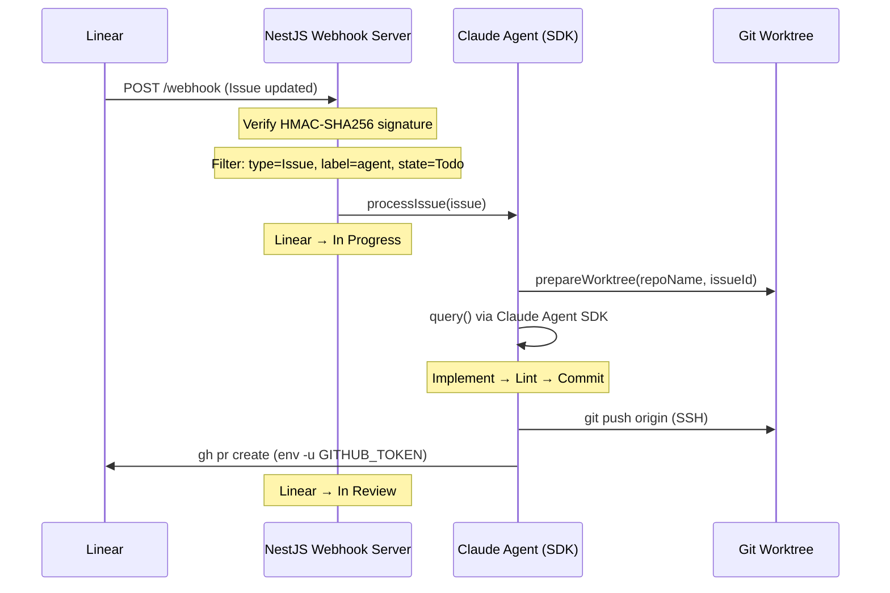

# Webhook-Driven Agent Architecture

## Context

We need a system that automatically implements Linear issues using Claude Code. The system must handle concurrent tasks, avoid duplicate processing, and remain cost-effective.

## Decision

A webhook-driven NestJS server that spawns isolated Claude agents per issue.

### Flow

### Trigger Conditions

An issue is processed only when ALL of the following are true:

| Field        | Required Value       |
| ------------ | -------------------- |
| `type`       | `Issue`              |
| `action`     | `create` or `update` |
| `labels`     | contains `agent`     |
| `state.name` | `Todo`               |

### Suspension on Max Turns

If the agent reaches `MAX_TURNS` (1000), the issue is automatically suspended:

1. Title prefixed with `[SUSPEND]`
2. Status set to `Suspended`

### Key Configuration

| Constant       | Source                                      | Purpose            |
| -------------- | ------------------------------------------- | ------------------ |
| `WORKSPACE`    | `process.env.WORKSPACE` \| `/app/workspace` | Git repo storage   |
| `MAX_TURNS`    | `repos.config.ts`                           | Agent turn limit   |
| `LINEAR_LABEL` | `repos.config.ts`                           | Trigger label name |

## Access Rules

1. **WebhookController**: Receives HTTP, validates signature, delegates to WebhookService.
2. **WebhookService**: Filters payload, calls `processIssue` fire-and-forget.
3. **agent.ts** (`processIssue`): Manages Linear state transitions and worktree lifecycle.
4. **sync-repos.ts**: Git operations only. No Linear or Claude SDK calls.
5. **linear.ts**: Linear API only. No git or file system operations.

## Do's and Don'ts

### Do

- Use SSH remotes for `git push` and `gh pr create`
- Unset `GITHUB_TOKEN` when calling `gh` (`env -u GITHUB_TOKEN gh pr create`)
- Always clean up worktrees in the `finally` block

### Don't

- Call `processIssue` from anywhere other than `WebhookService`
- Access the database or filesystem from `linear.ts`
- Block the webhook response — agent runs fire-and-forget

## Consequences

### Positive

- Each issue runs in an isolated git worktree — no cross-task interference
- Linear state reflects real progress (Todo → In Progress → In Review)

### Negative

- Long-running agents hold local disk (worktrees are cleaned on completion)
- `gh` auth depends on the machine's SSH key configuration
