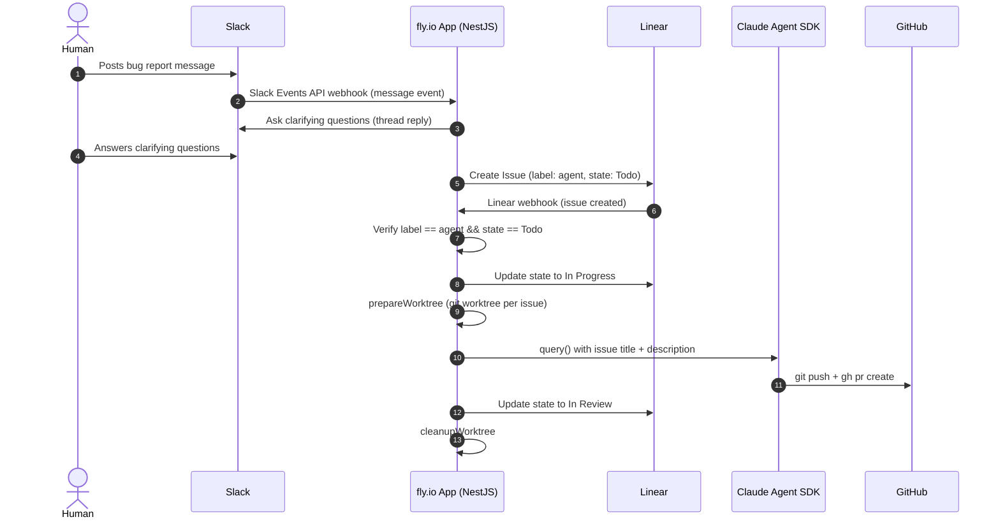

## Context

We need a reliable, end-to-end pipeline that takes a raw bug report from a human in Slack and produces a merge-ready Pull Request with minimal human toil. The system must run 24/7, be deployable with a single command, and coordinate three external services: Slack, Linear, and GitHub.

## Decision

We run a single NestJS process on **fly.io** that orchestrates the following pipeline:

### Component Responsibilities

#### fly.io (Hosting)

- Runs the NestJS application as a single persistent process.
- Exposes a public HTTPS endpoint required by both Slack Events API and Linear webhooks.
- Deployed via \`fly deploy\`; logs via \`fly logs\`.
- Mounts a persistent volume at \`/app/workspace\` for git worktrees.

#### Slack Integration (Bug Intake & Clarification)

- Receives bug reports via Slack Events API (\`message\` events in a designated channel).
- The app replies in-thread to ask structured clarifying questions (reproduction steps, environment, expected vs actual behaviour).
- Once clarification is complete, the app creates a Linear issue with the refined description.
- Uses \`SLACK_BOT_TOKEN\` and \`SLACK_SIGNING_SECRET\` environment variables.

#### Linear (Issue Tracking)

- Serves as the canonical task list for the agent.
- Issues are created by the app (from Slack intake) and consumed via Linear webhook.
- Trigger condition: issue must have label \`agent\` and state \`Todo\`.
- State transitions: Todo → In Progress (before Claude starts), In Progress → In Review (after PR), In Progress → Suspended (on max_turns).

#### Claude Agent SDK (Code Implementation)

- Invoked via \`query()\` from \`@anthropic-ai/claude-agent-sdk\`.
- Runs with \`cwd\` set to an isolated git worktree per issue for safe concurrency.
- Allowed tools restricted to: Read, Write, Skill, and targeted Bash commands (git add, git commit, git push, gh pr create, npm test, npm run lint).
- Hard cap of MAX_TURNS = 1000 per issue.

#### GitHub (Code Output)

- Each issue gets its own branch: \`claude/issue-<issueId>\`.
- Claude pushes the branch and opens a PR linking back to the Linear issue.
- Target repository is resolved from issue text against configured REPOS.

### Failure Modes

| Failure                   | Behaviour                                              |
| ------------------------- | ------------------------------------------------------ |
| Claude hits MAX_TURNS     | Issue title prefixed with [SUSPEND], state → Suspended |
| Claude throws error       | State reverted to Todo; worktree cleaned up            |
| Invalid webhook signature | 401 Unauthorized, request dropped                      |

## Do's and Don'ts

### Do

- Keep the Slack clarification loop in a thread to avoid channel noise.
- Set Linear state to In Progress **before** invoking Claude to prevent duplicate processing.
- Always clean up the git worktree in a \`finally\` block regardless of success or failure.
- Verify webhook signatures (HMAC-SHA256) for both Slack and Linear before processing any payload.
- Scope Claude's allowedTools to the minimum set needed.

### Don't

- Do not allow Claude to push directly to \`main\` or \`master\`; always use a feature branch.
- Do not share worktrees between concurrent issues.
- Do not hardcode repository names or org slugs — keep them in \`repos.config.ts\`.
- Do not process Linear webhooks if the issue lacks the \`agent\` label or is not in \`Todo\` state.

## Consequences

### Positive

- End-to-end automation from human bug report to reviewable PR with no manual triage steps.
- Slack thread clarification improves issue quality before Claude sees it.
- Worktree isolation enables safe concurrency.
- Linear state machine provides clear visibility into agent progress.

### Negative

- Clarification dialogue requires the human to remain engaged until questions are answered.
- fly.io persistent volume must be sized for concurrent worktrees.
- MAX_TURNS = 1000 means a runaway agent can consume significant API tokens before being suspended.

### Risks

- Slack Events API requires server response within 3 seconds; long-running setup must not block the HTTP response.
- Linear state guard (In Progress before query()) prevents double-execution but relies on atomic state update.

## Compliance and Enforcement

- Webhook signature verification is mandatory and must not be bypassed in any environment.
- All secrets must be provided via environment variables; no secrets in source code.
- PRs created by the agent must link back to their Linear issue in the PR body.

## References

- fly.io persistent volumes documentation
- Slack Events API documentation
- Linear Webhooks documentation
- Claude Agent SDK
- git worktree
