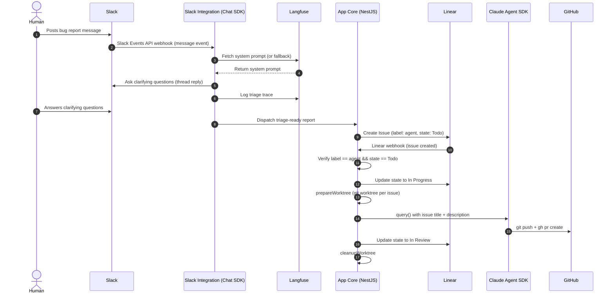

## Context

We need a reliable, end-to-end pipeline that takes a raw bug report from a human in Slack and produces a merge-ready Pull Request with minimal human toil. The system must run 24/7, be deployable with a single command, and coordinate three external services: Slack, Linear, and GitHub.

## Decision

We run a single NestJS process on **fly.io** that orchestrates the following pipeline:

```mermaid
sequenceDiagram
    autonumber
    actor Human
    participant Slack
    participant SlackInt as Slack Integration (Chat SDK)
    participant Langfuse
    participant App as App Core (NestJS)
    participant Linear
    participant Claude as Claude Agent SDK
    participant GitHub

    Human->>Slack: Posts bug report message
    Slack->>SlackInt: Slack Events API webhook (message event)
    SlackInt->>Langfuse: Fetch system prompt (or fallback)
    Langfuse-->>SlackInt: Return system prompt
    SlackInt->>Slack: Ask clarifying questions (thread reply)
    SlackInt->>Langfuse: Log triage trace
    Human->>Slack: Answers clarifying questions
    SlackInt->>App: Dispatch triage-ready report
    App->>Linear: Create Issue (label: agent, state: Todo)
    Linear->>App: Linear webhook (issue created)
    App->>App: Verify label == agent && state == Todo
    App->>Linear: Update state to In Progress
    App->>App: prepareWorktree (git worktree per issue)
    App->>Claude: query() with issue title + description
    Claude->>GitHub: git push + gh pr create
    App->>Linear: Update state to In Review
    App->>App: cleanupWorktree
```

### Component Responsibilities

#### fly.io (Hosting)

- Runs the NestJS application as a single persistent process.
- Exposes a public HTTPS endpoint required by both Slack Events API and Linear webhooks.
- Deployed via \`fly deploy\`; logs via \`fly logs\`.
- Mounts a persistent volume at \`/app/workspace\` for git worktrees.

#### Slack Integration (Bug Intake & Clarification)

- Receives bug reports via Slack Events API (\`message\` events in a designated channel).
- Powered by the **Chat SDK** (\`chat\` and \`@chat-adapter/slack\` / \`@chat-adapter/state-memory\`) to abstract Slack API plumbing (URL verification challenges, signature verification, and event routing) into high-level event listeners like \`onNewMention\` and \`onSubscribedMessage\`.
- Manages thread-based conversational history using the Chat SDK state adapter to support multi-turn triage interactions.
- The app replies in-thread to ask structured clarifying questions (reproduction steps, environment, expected vs actual behaviour).
- The triage clarification loop is orchestrated by a **Mastra Workflow** (`bugTriageWorkflow`) registered in `MastraProvider`. The workflow implements three branches:
  - **Complete report**: Creates a Linear issue, posts the URL to Slack, and unsubscribes.
  - **Incomplete with clarifying question**: Posts the question to Slack (does not unsubscribe; awaits user response).
  - **Max rounds exhausted or no question available**: Posts a fallback message and unsubscribes.
- Once clarification is complete (or max rounds exceeded), the workflow terminates and Slack integration awaits the next message in the thread.
- Uses \`SLACK_BOT_TOKEN\` and \`SLACK_SIGNING_SECRET\` environment variables.

#### Linear (Issue Tracking)

- Serves as the canonical task list for the agent.
- Issues are created by the app (from Slack intake) and consumed via Linear webhook.
- Trigger condition: issue must have label \`agent\` and state \`Todo\`.
- State transitions: Todo → In Progress (before Claude starts), In Progress → In Review (after PR), In Progress → Suspended (on max_turns).

#### Claude Agent SDK (Code Implementation)

- Invoked via \`query()\` from \`@anthropic-ai/claude-agent-sdk\`.
- Runs with \`cwd\` set to an isolated git worktree per issue for safe concurrency.
- Allowed tools restricted to: Read, Write, Skill, and targeted Bash commands (git add, git commit, git push, gh pr create, npm test, npm run lint).
- Hard cap of MAX_TURNS = 1000 per issue.

#### GitHub (Code Output)

- Each issue gets its own branch: \`claude/issue-<issueId>\`.
- Claude pushes the branch and opens a PR linking back to the Linear issue.
- Target repository is resolved from issue text against configured REPOS.

#### Langfuse (Prompt Management & Observability)

- Stores and versions LLM prompt templates (such as \`bug-triage-system\`) to allow prompt refinement without app redeployment.
- Retrieves and compiles prompt templates dynamically at runtime, falling back to a local default prompt if the API is slow or unreachable.
- Instruments and traces LLM execution, linking prompt versions to telemetry to monitor agent performance, latency, and costs.

### Failure Modes

| Failure                   | Behaviour                                              |
| ------------------------- | ------------------------------------------------------ |
| Claude hits MAX_TURNS     | Issue title prefixed with [SUSPEND], state → Suspended |
| Claude throws error       | State reverted to Todo; worktree cleaned up            |
| Invalid webhook signature | 401 Unauthorized, request dropped                      |

## Do's and Don'ts

### Do

- Keep the Slack clarification loop in a thread to avoid channel noise.
- Set Linear state to In Progress **before** invoking Claude to prevent duplicate processing.
- Always clean up the git worktree in a \`finally\` block regardless of success or failure.
- Verify webhook signatures (HMAC-SHA256) for both Slack and Linear before processing any payload.
- Scope Claude's allowedTools to the minimum set needed.
- Make every Mastra \`.branch([...])\` set of conditions mutually exclusive **and** collectively exhaustive so exactly one branch runs per turn. Express the final fallback as the explicit negation of the other conditions (e.g. \`!isComplete && !hasQuestionAndRounds\`), not as an always-true predicate.
- Always inspect the result of \`run.start(...)\` for a Mastra workflow. A step failure does **not** reject the promise — the run resolves with \`result.status === "failed"\` and a \`result.error\` payload. On \`failed\`, raise/handle the error (report via the \`logger\` util per BE-003) and notify the reporter in-thread so they are never left without a response.
- Route every LLM system/instruction prompt through the Langfuse util's fetch-with-local-fallback methods (e.g. \`langfuse.fetchTriagePrompt\`, \`fetchFormatPrompt\`, \`fetchTaskPrompt\`), and register each prompt in Langfuse under a name centralized in \`LANGFUSE_PROMPT_NAMES\` (\`src/constants/mastra.constants.ts\`) with a matching local fallback template.

### Don't

- Do not allow Claude to push directly to \`main\` or \`master\`; always use a feature branch.
- Do not share worktrees between concurrent issues.
- Do not hardcode repository names or org slugs — keep them in \`repos.config.ts\`.
- Do not process Linear webhooks if the issue lacks the \`agent\` label or is not in \`Todo\` state.
- Do not use a catch-all / always-true condition as the fallback branch in a Mastra \`.branch([...])\`. Mastra evaluates **every** condition and runs **all** matching branches in parallel (it is not if/else-if/else), so an always-true fallback fires on every run alongside the real branch — causing duplicate side effects such as double Slack posts and an unintended \`unsubscribe\` (root cause of the bug-triage duplicate-response incident).
- Do not pass a hardcoded prompt string directly to an LLM call (e.g. \`system: SOME_CONSTANT\` or an inline template). All prompts MUST be fetched from Langfuse with a local fallback so prompt edits do not require a redeploy and a fetch outage never hard-fails; local prompt constants may exist only as fallbacks.

## Consequences

### Positive

- End-to-end automation from human bug report to reviewable PR with no manual triage steps.
- Slack thread clarification improves issue quality before Claude sees it.
- Worktree isolation enables safe concurrency.
- Linear state machine provides clear visibility into agent progress.

### Negative

- Clarification dialogue requires the human to remain engaged until questions are answered.
- fly.io persistent volume must be sized for concurrent worktrees.
- MAX_TURNS = 1000 means a runaway agent can consume significant API tokens before being suspended.

### Risks

- Slack Events API requires server response within 3 seconds; long-running setup must not block the HTTP response.
- Linear state guard (In Progress before query()) prevents double-execution but relies on atomic state update.

## Compliance and Enforcement

- Webhook signature verification is mandatory and must not be bypassed in any environment.
- All secrets must be provided via environment variables; no secrets in source code.
- PRs created by the agent must link back to their Linear issue in the PR body.

## References

- fly.io persistent volumes documentation
- Slack Events API documentation
- Linear Webhooks documentation
- Claude Agent SDK
- git worktree
