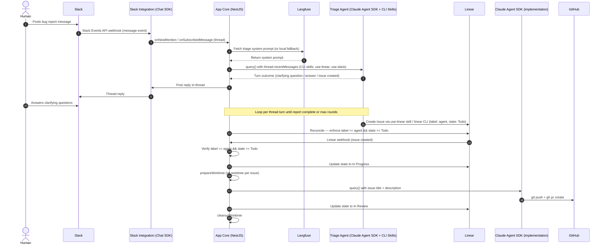

## Context

We need a reliable, end-to-end pipeline that takes a raw bug report from a human in Slack and produces a merge-ready Pull Request with minimal human toil. The system must run 24/7, be deployable with a single command, and coordinate three external services: Slack, Linear, and GitHub.

## Decision

We run a single NestJS process on **fly.io** that orchestrates the following pipeline:

```mermaid
sequenceDiagram
    autonumber
    actor Human
    participant Slack
    participant ChatSDK as Slack Integration (Chat SDK)
    participant App as App Core (NestJS)
    participant Langfuse
    participant Triage as Triage Agent (Claude Agent SDK + CLI Skills)
    participant Linear
    participant Claude as Claude Agent SDK (implementation)
    participant GitHub

    Human->>Slack: Posts bug report message
    Slack->>ChatSDK: Slack Events API webhook (message event)
    ChatSDK->>App: onNewMention / onSubscribedMessage (thread)
    App->>Langfuse: Fetch triage system prompt (or local fallback)
    Langfuse-->>App: Return system prompt
    App->>Triage: query() with thread.recentMessages (CLI skills: use-linear, use-slack)
    Triage-->>App: Turn outcome (clarifying question / answer / issue created)
    App->>ChatSDK: Post reply in-thread
    ChatSDK->>Slack: Thread reply
    Human->>Slack: Answers clarifying questions
    Note over App,Triage: Loop per thread turn until report complete or max rounds
    Triage->>Linear: Create Issue via use-linear skill / linear CLI (label: agent, state: Todo)
    App->>Linear: Reconcile — enforce label == agent && state == Todo
    Linear->>App: Linear webhook (issue created)
    App->>App: Verify label == agent && state == Todo
    App->>Linear: Update state to In Progress
    App->>App: prepareWorktree (git worktree per issue)
    App->>Claude: query() with issue title + description
    Claude->>GitHub: git push + gh pr create
    App->>Linear: Update state to In Review
    App->>App: cleanupWorktree
```

### Component Responsibilities

#### fly.io (Hosting)

- Runs the NestJS application as a single persistent process.
- Exposes a public HTTPS endpoint required by both Slack Events API and Linear webhooks.
- Deployed via \`fly deploy\`; logs via \`fly logs\`.
- Mounts a persistent volume at \`/app/workspace\` for git worktrees.

#### Slack Integration (Bug Intake & Clarification)

- Receives bug reports via Slack Events API (\`message\` events in a designated channel).
- Powered by the **Chat SDK** (\`chat\` and \`@chat-adapter/slack\` / \`@chat-adapter/state-memory\`) to abstract Slack API plumbing (URL verification challenges, signature verification, and event routing) into high-level event listeners like \`onNewMention\` and \`onSubscribedMessage\`.
- Manages thread-based conversational history using the Chat SDK state adapter to support multi-turn triage interactions.
- The app replies in-thread to ask structured clarifying questions (reproduction steps, environment, expected vs actual behaviour). **All Slack I/O — inbound Events webhook, thread history, posting, and subscribe/unsubscribe — goes through the Chat SDK using the bot token.** MCP cannot replace this (MCP is outbound tool-calling and cannot receive inbound Slack Events).
- Uses \`SLACK_BOT_TOKEN\` and \`SLACK_SIGNING_SECRET\` environment variables.

#### Triage Agent (Claude Agent SDK + CLI-backed Skills)

- The triage clarification loop is orchestrated by a **single agentic Claude Agent SDK \`query()\` session per Slack thread turn** (the \`TriageAgent\`), replacing the previous Mastra Workflow. This is the Coordinator-layer orchestration primitive for triage per [BE-001](./BE-001-layer-architecture.md).
- Each turn the agent classifies intent (question | bug | feature_request) and produces exactly one outcome:
  - **Complete report**: Creates a Linear issue via the **use-linear** skill / `linear issue create` CLI; the app posts the URL to Slack (Chat SDK) and unsubscribes.
  - **Incomplete with clarifying question**: The app posts the question to Slack (does not unsubscribe; awaits the user's response).
  - **Question**: The app posts the answer to Slack and stays subscribed for follow-ups.
  - **Max rounds exhausted**: Best-effort issue or a fallback message, then unsubscribe.
- **Linear issue creation is performed by the agent via the official Linear MCP server** configured through the SDK \`mcpServers\` option. The agent's tool access is least-privilege: an \`allowedTools\` allowlist of only the needed Linear tools (create + minimal reads) plus Slack **search/read** tools, a \`disallowedTools\` denylist for destructive Linear tools **and all Slack write/post tools**, and \`PreToolUse\` deny-hooks rejecting destructive Linear operations (delete/archive/cancel) and any non-read Slack tool (fail closed).
- **The downstream trigger invariant (label \`agent\` + state \`Todo\`) MUST NOT be left solely to the LLM.** Because a language model creates the issue via the \`use-linear\` CLI skill, a thin **reconciliation Command** over \`LinearTransfer\` verifies and enforces the \`agent\` label and \`Todo\` state immediately after creation.
- **The Slack MCP is used for READ/SEARCH ONLY**, as an augmentation on top of Chat SDK: the agent may search the workspace for related or duplicate discussions before creating an issue. **No Slack write/post tool is allowlisted** — all Slack posting stays on the Chat SDK bot-token integration. Slack MCP _posting_ was rejected because Slack's official MCP (\`mcp.slack.com\`) is user-OAuth, admin-gated, and acts as an authenticated Slack _user_, not a bot; restricting it to search keeps that constraint contained and makes the capability non-blocking (a token lapse merely skips the duplicate-check search).
- Once clarification is complete (or max rounds exceeded), the session ends and the app awaits the next message in the thread.

#### Linear (Issue Tracking)

- Serves as the canonical task list for the agent.
- Issues are created by the app (from Slack intake) and consumed via Linear webhook.
- Trigger condition: issue must have label \`agent\` and state \`Todo\`.
- State transitions: Todo → In Progress (before Claude starts), In Progress → In Review (after PR), In Progress → Suspended (on max_turns).

#### Claude Agent SDK (Code Implementation)

- Invoked via \`query()\` from \`@anthropic-ai/claude-agent-sdk\`.
- Runs with \`cwd\` set to an isolated git worktree per issue for safe concurrency.
- Allowed tools restricted to: Read, Write, Skill, and targeted Bash commands (git add, git commit, git push, gh pr create, npm test, npm run lint).
- Hard cap of MAX_TURNS = 1000 per issue.

#### GitHub (Code Output)

- Each issue gets its own branch: \`claude/issue-<issueId>\`.
- Claude pushes the branch and opens a PR linking back to the Linear issue.
- Target repository is resolved from issue text against configured REPOS.

#### Langfuse (Prompt Management)

- Stores and versions LLM prompt templates (such as the triage system prompt) to allow prompt refinement without app redeployment.
- Retrieves and compiles prompt templates dynamically at runtime, falling back to a local default prompt if the API is slow or unreachable.
- **Prompt management is retained; the previous \`@mastra/observability\` tracing exporter is removed** as part of the Claude Agent SDK migration. Tracing is provided by the Claude Agent SDK's own message stream / hooks (tool-use and result logging via the \`logger\` util), optionally augmented with manual Langfuse JS SDK spans.

### Failure Modes

| Failure                   | Behaviour                                              |
| ------------------------- | ------------------------------------------------------ |
| Claude hits MAX_TURNS     | Issue title prefixed with [SUSPEND], state → Suspended |
| Claude throws error       | State reverted to Todo; worktree cleaned up            |
| Invalid webhook signature | 401 Unauthorized, request dropped                      |

## Do's and Don'ts

### Do

- Keep the Slack clarification loop in a thread to avoid channel noise.
- Set Linear state to In Progress **before** invoking Claude to prevent duplicate processing.
- Always clean up the git worktree in a \`finally\` block regardless of success or failure.
- Verify webhook signatures (HMAC-SHA256) for both Slack and Linear before processing any payload.
- Scope the triage agent's \`allowedTools\` to the minimum set needed (\`Bash\`, \`Skill\`, \`Read\`), with a \`PreToolUse\` deny-hook on Bash commands that rejects destructive/write patterns (e.g. \`linear issue delete|archive|cancel\`, \`linear ... update ... state\`, \`slack-cli send|edit|delete\`) fail-closed.
- Implement the deny-hook with the exact Claude Agent SDK hook contract: signature \`(input: PreToolUseHookInput, toolUseID, options) => Promise<HookJSONOutput>\`, read the command from \`input.tool_input.command\` (snake_case), and deny by returning \`{ hookSpecificOutput: { hookEventName: 'PreToolUse', permissionDecision: 'deny', permissionDecisionReason } }\`. Write deny patterns robust to shell chaining (match at start OR after a separator such as \`&&\`, \`;\`, \`|\`, or a backtick), not start-anchored, so \`echo x && linear issue delete X\` is still blocked.
- Enforce the downstream trigger invariant deterministically: after the agent creates a Linear issue via the use-linear skill / \`linear issue create\` CLI, run a **reconciliation Command** over \`LinearTransfer\` that verifies and sets the \`agent\` label and \`Todo\` state. Never rely solely on the LLM to satisfy an invariant another system depends on.
- Inspect the result of the triage \`query()\` message stream: detect the terminal \`result\` message and its \`subtype\` (e.g. \`error_max_turns\`), and on failure report via the \`logger\` util (per BE-003) and notify the reporter in-thread so they are never left without a response.
- Route every LLM system/instruction prompt through the Langfuse util's fetch-with-local-fallback methods (e.g. \`langfuse.fetchTriageAgentPrompt\`, \`fetchTaskPrompt\`), and register each prompt in Langfuse under a name centralized in \`LANGFUSE_PROMPT_NAMES\` with a matching local fallback template.
- Treat the triage \`query()\` session as Coordinator-layer orchestration per [BE-001](./BE-001-layer-architecture.md): the agent may perform side-effects through CLI-backed skills (the Bash tool), but any deterministic business guarantee MUST still be owned by a Command/Query (the reconciliation Command above).
- Perform all Slack I/O (intake, thread history, posting, subscribe/unsubscribe) through the Chat SDK bot-token integration. When the agent needs local reference files (e.g. the DDD domain docs under \`docs/domain/\*\`), give it read-only, directory-scoped access via the SDK's built-in filesystem tools jailed to a named directory constant ([GEN-001](./GEN-001-magic-number-and-status-management.md)), and instruct it (via its Langfuse prompt) to read at most the 1–2 most relevant files. Because such docs may be gitignored/auto-generated, ensure they ship in the deployed image and that the agent degrades gracefully when they are absent (per BE-003).

### Don't

- Do not allow Claude to push directly to \`main\` or \`master\`; always use a feature branch.
- Do not share worktrees between concurrent issues.
- Do not hardcode repository names or org slugs — keep them in \`repos.config.ts\`.
- Do not process Linear webhooks if the issue lacks the \`agent\` label or is not in \`Todo\` state.
- Do not let a single triage turn produce more than one Slack side-effect (one clarifying question / answer, or one issue-created message + unsubscribe). Duplicate posts and an unintended \`unsubscribe\` were the root cause of the bug-triage duplicate-response incident; keep the per-turn outcome singular and idempotent.
- Do not rely on the LLM (or a CLI command) alone to satisfy an invariant another system depends on — most importantly the \`agent\` label + \`Todo\` state that gates the downstream Linear webhook. Enforce it with the reconciliation Command.
- Do not grant the triage agent unscoped Bash access. Maintain a tight \`allowedTools\` list (\`Bash\`, \`Skill\`, \`Read\`) and a \`PreToolUse\` deny-hook on Bash that pattern-matches and rejects destructive/write commands; fail closed by RETURNING \`{ hookSpecificOutput: { permissionDecision: 'deny' } }\` (never by throwing) on any denied pattern.
- Do not deny a tool by throwing from the hook, and do not use a \`(toolName, input)\` hook signature — the Claude Agent SDK invokes PreToolUse hooks as \`(input, toolUseID, options)\`, so a throwing or mis-signatured hook silently fails OPEN and leaves the agent unrestricted. Do not treat \`disallowedTools\` (or an empty denylist) as the CLI-safety backstop; with Bash access the deny-hook IS the enforcement and MUST be verified against the real SDK types under a \`tsc --noEmit\` gate (see [BE-004](./BE-004-test-for-bussiness-logic.md)).
- Do not route Slack **write/post** commands through the agent's Bash tool. The \`use-slack\` skill supports search/read only; all Slack posting and thread/subscription management stays on the Chat SDK bot-token integration. Never allow the agent to run \`slack-cli send|edit|delete|upload|reaction|pin\` — the deny-hook must block these.
- Do not pass a hardcoded prompt string directly to an LLM call (e.g. \`system: SOME_CONSTANT\` or an inline template). All prompts MUST be fetched from Langfuse with a local fallback so prompt edits do not require a redeploy and a fetch outage never hard-fails; local prompt constants may exist only as fallbacks.
- Do not place reusable or side-effecting business logic (Linear state transitions, repository writes, anything reused elsewhere) outside a Command or Query just because an agent could do it via a CLI skill; deterministic business logic belongs in a Command or Query.

## Consequences

### Positive

- End-to-end automation from human bug report to reviewable PR with no manual triage steps.
- Slack thread clarification improves issue quality before Claude sees it.
- Worktree isolation enables safe concurrency.
- Linear state machine provides clear visibility into agent progress.

### Negative

- Clarification dialogue requires the human to remain engaged until questions are answered.
- fly.io persistent volume must be sized for concurrent worktrees.
- MAX_TURNS = 1000 means a runaway agent can consume significant API tokens before being suspended.

### Risks

- Slack Events API requires server response within 3 seconds; long-running setup must not block the HTTP response.
- Linear state guard (In Progress before query()) prevents double-execution but relies on atomic state update.

## Compliance and Enforcement

- Webhook signature verification is mandatory and must not be bypassed in any environment.
- All secrets must be provided via environment variables; no secrets in source code.
- PRs created by the agent must link back to their Linear issue in the PR body.

## References

- [BE-001 — Layer Architecture](./BE-001-layer-architecture.md): the triage `query()` session as Coordinator-layer orchestration, and where CLI/skill side-effects sit relative to Command/Transfer
- fly.io persistent volumes documentation
- Slack Events API documentation
- Linear Webhooks documentation
- Claude Agent SDK — skill discovery (`cwd`, `settingSources`, `skills`), `allowedTools` / `disallowedTools`, `PreToolUse` hooks
- `use-linear` skill (`/root/.claude/skills/use-linear/SKILL.md`) — wraps `linear` CLI, requires `LINEAR_API_KEY`
- `use-slack` skill (`/root/.claude/skills/use-slack/SKILL.md`) — wraps `slack-cli` CLI, read/search only, requires xoxp user token configured via `slack-cli config`
- git worktree
