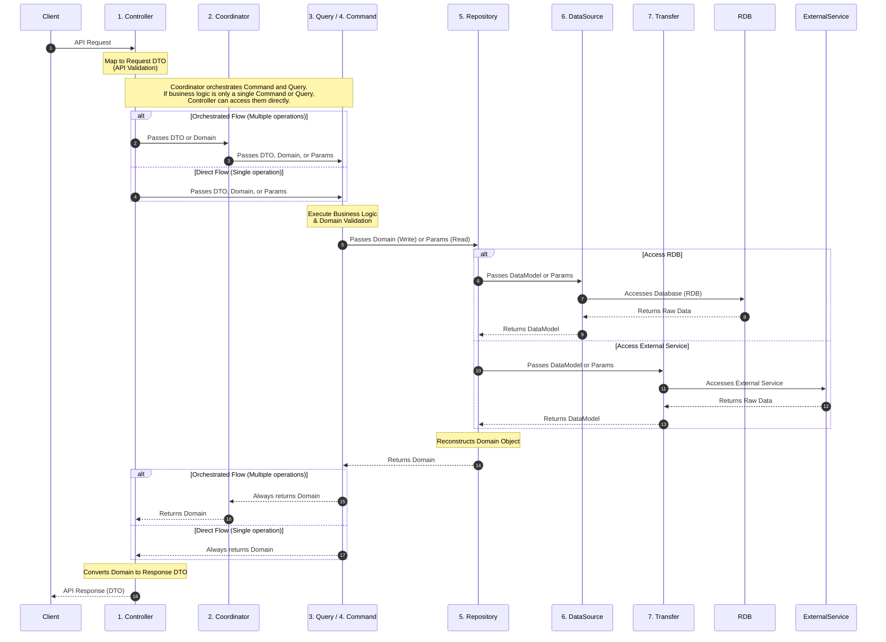

## Context

To maintain high code quality, reduce the introduction of bugs, and ensure the codebase remains easy to modify as the project grows, we need a clear and consistent backend architectural pattern. This ADR defines the "Lauer" layered architecture, its access rules, and data structures.

## Decision

We adopt a layered architecture with CQRS (Command Query Responsibility Segregation) principles. The architecture is divided into the following layers and data structures:

### Layer rules



### Data Structures & Validation

- **DTO (Data Transfer Object)**:
  - Used in the **Controller** layer.
- **Domain**:
  READ `adr/BE-002-manage-data-domain.md`

### Access Rules

1.  **Controller**: Entry point. Accesses Coordinator, Query, and Command. Uses DTOs for request handling and is responsible for converting returned Domain objects into Response DTOs.
2.  **Coordinator** (Read/Write): Orchestrates complex flows. Uses Domain objects. The coordinator's sole purpose is the **orchestration** of commands and queries. It must not be used if no orchestration is needed (e.g., merely wrapping a single command or query).
    - **Bad** (Just a wrapper, no orchestration):
      ```typescript
      class TodoCoordinator {
        findAll() {
          return this.todoQuery.findAll(); // It is just a wrapper, not orchestrating.
        }
      }
      ```
    - **Good** (Orchestrates multiple operations, e.g., Query then Command):
      ```typescript
      class ReservationCoordinator {
        async reserve(id: string) {
          const user = await this.userRepository.findById(id);
          await this.scheduleRepository.reserve(user, "YYYYMMDD"); // Includes Query and Command. It is OK.
        }
      }
      ```
    - **Mastra Workflows as orchestration**: A Mastra Workflow (`createWorkflow` / `createStep`) used to orchestrate a flow **IS** a Coordinator-layer construct and is governed by the same rules. Its steps MUST call the existing **Query** and **Command** layers and MUST NOT reimplement business or side-effect logic. Because workflow steps are module-scope functions that run **outside** NestJS dependency injection, all runtime dependencies (injected Query/Command instances, request-scoped objects such as a Chat SDK `thread`) MUST be passed per-run via Mastra `RequestContext`. `RequestContext` is a typed **Map-like** container: construct it from `[key, value]` tuples and read values inside steps with `.get("key")` — never from a plain object literal and never via property access or an unsafe cast. See `src/slack-bug-intake/workflow/bug-triage.workflow.ts` and `src/slack-bug-intake/coordinator/slack-bot.coordinator.ts`.
      - **Good** (deps via `RequestContext` tuples; steps call Query/Command):

        ```typescript
        // Coordinator: inject per-run deps as [key, value] tuples
        const requestContext = new RequestContext<BugTriageRuntimeContext>([
          ["thread", thread],
          ["evaluateBugReport", this.evaluateBugReport], // Query
          ["createLinearIssue", this.createLinearIssue], // Command
        ]);
        await run.start({ inputData, requestContext });

        // Step: read deps with .get(), delegate to Query/Command
        execute: async ({ requestContext }) => {
          const evaluateBugReport = requestContext.get("evaluateBugReport");
          return evaluateBugReport.execute(/* ... */);
        };
        ```

      - **Bad** (object literal + property access; logic inlined in the step):
        ```typescript
        const requestContext = new RequestContext({ thread, createLinearIssue }); // ✗ not Map-like
        execute: async ({ requestContext }) => {
          const { thread } = requestContext as BugTriageRuntimeContext; // ✗ unsafe cast
          await linearClient.issues.create(/* ... */); // ✗ side-effect logic belongs in a Command
        };
        ```

3.  **Query** (Read-only): Data retrieval.
4.  **Command** (Write-only): Data modification.
5.  **Repository**: Aggregates data for domain-unit access. Accesses DataSource and Transfer.
6.  **DataSource**: 1:1 mapping to database tables (RDB).
7.  **Transfer**: Wrapper for accessing **business** external services (e.g., Firebase, Slack, Linear, GitHub). It is accessed by the Repository layer and handles the communication and data mapping to/from external services. The Transfer layer is **only** for business external services that a Repository orchestrates to reconstruct Domain objects. It is **not** the home for cross-cutting infrastructure clients — observability/tracing, prompt management, and agent frameworks (e.g., Langfuse, Mastra) belong in `src/util/` as singletons even though they call external APIs (see `GEN-002-project-folder-structure.md`).

### Naming Convention

We prioritize naming that reflects **business logic** and domain language over technical implementation details.

- **Good**: `reserveSchedules`, `calculateShippingFee`, `cancelOrder`
- **Avoid**: `addReservation`, `getShippingTotal`, `deleteOrderEntry`

## Do's and Don'ts

### Do

- Use **DTOs** for all external API request mapping.
- Place strict business validation logic inside **Domain** classes.
- Use the **Query** layer for all read-only logic.
- Use the **Command** layer for all write/modification logic.
- **Always return Domain objects** from both Query and Command layers.
- Keep each function small with a single responsibility.
- Place cross-cutting infrastructure clients (logging, tracing/observability, prompt management, agent frameworks) in `src/util/` as singletons; any layer may reference them directly.
- Treat a Mastra Workflow (`createWorkflow` / `createStep`) as Coordinator-layer orchestration: have its steps delegate to the existing **Query** and **Command** layers.
- Pass all per-run dependencies (Query/Command instances, request-scoped objects such as a Chat SDK `thread`) into workflow steps via Mastra `RequestContext`, constructed from `[key, value]` tuples and read inside steps with `.get("key")`.

### Don't

- Perform business logic validation in the DTO or Controller.
- Access the **DataSource**, **Repository**, or **Transfer** directly from the **Controller**.
- Access the RDB from any layer other than **Repository** or **DataSource**.
- Perform write operations within the **Query** layer.
- Reimplement business or side-effect logic inside a Mastra workflow step; the step MUST call a **Command** or **Query** instead.
- Construct Mastra `RequestContext` from a plain object literal, or read step dependencies via property access or an unsafe cast (`requestContext as SomeType`); use tuple construction and `.get("key")`.
- Route observability, prompt-management, or agent-framework clients through the **Transfer** layer just because they call an external API. Transfer is reserved for business external services accessed by a Repository to reconstruct Domain objects; cross-cutting infrastructure clients belong in `src/util/`.

## Consequences

### Positive

- Stronger data integrity due to validation at both API (DTO) and Business (Domain) levels.
- Code matches business language, improving clarity.
- Small function responsibility leads to easier maintenance and fewer bugs.
- Clear separation of concerns for internal RDB access and external service integration.

### Negative

- Increased boilerplate code (mapping between DTO, Domain, DataModel, and external service models).

### Risks

- Over-engineering for simple CRUD operations.

## Compliance and Enforcement

This decision will be enforced through architectural reviews and automated linting.

## References

- [Project Folder Structure](./GEN-002-project-folder-structure.md) — where each layer's files live, and the `src/util/` singleton rule for cross-cutting infrastructure clients
- CQRS Pattern
- Domain-Driven Design (Validation)
- Clean Architecture
