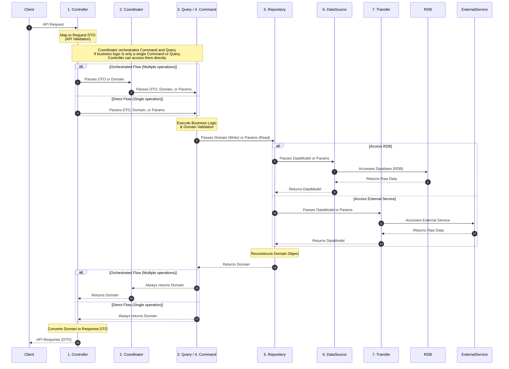

## Context

To maintain high code quality, reduce the introduction of bugs, and ensure the codebase remains easy to modify as the project grows, we need a clear and consistent backend architectural pattern. This ADR defines the "Lauer" layered architecture, its access rules, and data structures.

## Decision

We adopt a layered architecture with CQRS (Command Query Responsibility Segregation) principles. The architecture is divided into the following layers and data structures:

### Layer rules



### Data Structures & Validation

- **DTO (Data Transfer Object)**:
  - Used in the **Controller** layer.
- **Domain**:
  READ `adr/BE-002-manage-data-domain.md`

### Access Rules

1.  **Controller**: Entry point. Accesses Coordinator, Query, and Command. Uses DTOs for request handling and is responsible for converting returned Domain objects into Response DTOs.
2.  **Coordinator** (Read/Write): Orchestrates complex flows. Uses Domain objects. The coordinator's sole purpose is the **orchestration** of commands and queries. It must not be used if no orchestration is needed (e.g., merely wrapping a single command or query).
    - **Bad** (Just a wrapper, no orchestration):
      ```typescript
      class TodoCoordinator {
        findAll() {
          return this.todoQuery.findAll(); // It is just a wrapper, not orchestrating.
        }
      }
      ```
    - **Good** (Orchestrates multiple operations, e.g., Query then Command):
      ```typescript
      class ReservationCoordinator {
        async reserve(id: string) {
          const user = await this.userRepository.findById(id);
          await this.scheduleRepository.reserve(user, "YYYYMMDD"); // Includes Query and Command. It is OK.
        }
      }
      ```
    - **Claude Agent SDK agentic session as orchestration**: A Claude Agent SDK `query()` session used to orchestrate a flow (e.g. the Slack triage agent) **IS** a Coordinator-layer construct and is governed by the same rules. The Coordinator owns the session: it assembles the prompt from request-scoped inputs (e.g. a Chat SDK `thread`'s recent messages), configures the agent's tools, runs the session, and acts on the outcome. This replaces the previous Mastra Workflow orchestration.
      - **Side-effects via MCP tools are permitted inside the agentic Coordinator** (e.g. the agent creating a Linear issue via the Linear MCP server), because the agent's tool use is itself the orchestration. **However, any deterministic business guarantee — especially an invariant another system depends on — MUST NOT be left solely to the LLM.** It MUST be enforced by a **Command** or **Query** after the fact. The canonical example: the triage agent creates a Linear issue via MCP, then a **reconciliation Command** over `LinearTransfer` verifies and enforces the `agent` label and `Todo` state that gates the downstream Linear webhook (see [ARCH-001](./ARCH-001-production-architecture.md)).
      - **Good** (Coordinator runs the agent; a Command guarantees the invariant):

        ```typescript
        // Coordinator: build prompt from request-scoped input, run scoped agent
        const outcome = await this.triageAgent.run(thread.recentMessages); // creates issue via Linear MCP
        if (outcome.issueCreated) {
          await this.reconcileLinearIssue.execute(outcome.issueId); // Command enforces label=agent + state=Todo
          await thread.post(outcome.message); // Slack I/O via Chat SDK
          await thread.unsubscribe();
        }
        ```

      - **Bad** (relying on the LLM alone for a deterministic invariant):
        ```typescript
        // ✗ trusts the model to always set label=agent + state=Todo — downstream webhook silently breaks when it doesn't
        await this.triageAgent.run(thread.recentMessages);
        // ✗ no reconciliation Command; no deterministic guarantee
        ```

3.  **Query** (Read-only): Data retrieval.
4.  **Command** (Write-only): Data modification.
5.  **Repository**: Aggregates data for domain-unit access. Accesses DataSource and Transfer.
6.  **DataSource**: 1:1 mapping to database tables (RDB).
7.  **Transfer**: Wrapper for accessing **business** external services (e.g., Firebase, Slack, Linear, GitHub). It is accessed by the Repository layer and handles the communication and data mapping to/from external services. The Transfer layer is **only** for business external services that a Repository orchestrates to reconstruct Domain objects. It is **not** the home for cross-cutting infrastructure clients — observability/tracing and prompt management (e.g., Langfuse) belong in `src/util/` as singletons even though they call external APIs (see `GEN-002-project-folder-structure.md`).

### Naming Convention

We prioritize naming that reflects **business logic** and domain language over technical implementation details.

- **Good**: `reserveSchedules`, `calculateShippingFee`, `cancelOrder`
- **Avoid**: `addReservation`, `getShippingTotal`, `deleteOrderEntry`

## Do's and Don'ts

### Do

- Use **DTOs** for all external API request mapping.
- Place strict business validation logic inside **Domain** classes.
- Use the **Query** layer for all read-only logic.
- Use the **Command** layer for all write/modification logic.
- **Always return Domain objects** from both Query and Command layers.
- Keep each function small with a single responsibility.
- Place cross-cutting infrastructure clients (logging, tracing/observability, prompt management) in `src/util/` as singletons; any layer may reference them directly.
- Treat a Claude Agent SDK `query()` session as Coordinator-layer orchestration: the Coordinator assembles the prompt from request-scoped inputs, configures scoped agent tools, runs the session, and acts on the outcome.
- After an agent performs a side-effect via an MCP tool, enforce any deterministic business guarantee with a **Command** or **Query** (e.g. a reconciliation Command that sets the `agent` label + `Todo` state a downstream system depends on).
- Scope the agent's MCP tool access to least-privilege (`allowedTools` allowlist, `disallowedTools` denylist, and a `PreToolUse` deny-hook for destructive tools).

### Don't

- Perform business logic validation in the DTO or Controller.
- Access the **DataSource**, **Repository**, or **Transfer** directly from the **Controller**.
- Access the RDB from any layer other than **Repository** or **DataSource**.
- Perform write operations within the **Query** layer.
- Rely on an agent (LLM) or an MCP tool call alone to satisfy a deterministic business invariant that another system depends on; that guarantee MUST be owned by a **Command** or **Query**.
- Grant an agentic `query()` session unscoped MCP tool access; always set `allowedTools` and deny destructive tools.
- Perform Slack **I/O** (inbound webhook, posting, subscribe/unsubscribe) for the triage flow through anything other than the Chat SDK bot-token integration. The Slack MCP is permitted for **read/search only** (e.g. duplicate-discussion lookup) with all write/post tools denied; never allowlist a Slack write tool or route Slack posting through MCP (it runs as a user, not the bot).
- Route observability or prompt-management clients through the **Transfer** layer just because they call an external API. Transfer is reserved for business external services accessed by a Repository to reconstruct Domain objects; cross-cutting infrastructure clients belong in `src/util/`.

## Consequences

### Positive

- Stronger data integrity due to validation at both API (DTO) and Business (Domain) levels.
- Code matches business language, improving clarity.
- Small function responsibility leads to easier maintenance and fewer bugs.
- Clear separation of concerns for internal RDB access and external service integration.

### Negative

- Increased boilerplate code (mapping between DTO, Domain, DataModel, and external service models).

### Risks

- Over-engineering for simple CRUD operations.

## Compliance and Enforcement

This decision will be enforced through architectural reviews and automated linting.

## References

- [Project Folder Structure](./GEN-002-project-folder-structure.md) — where each layer's files live, and the `src/util/` singleton rule for cross-cutting infrastructure clients
- [ARCH-001 — Production Architecture](./ARCH-001-production-architecture.md) — the Claude Agent SDK triage agent as a Coordinator-layer orchestration, and the Linear-issue label/state reconciliation Command
- CQRS Pattern
- Domain-Driven Design (Validation)
- Clean Architecture
